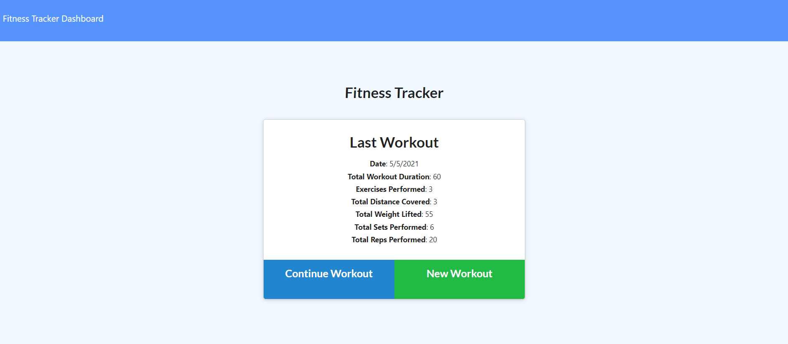
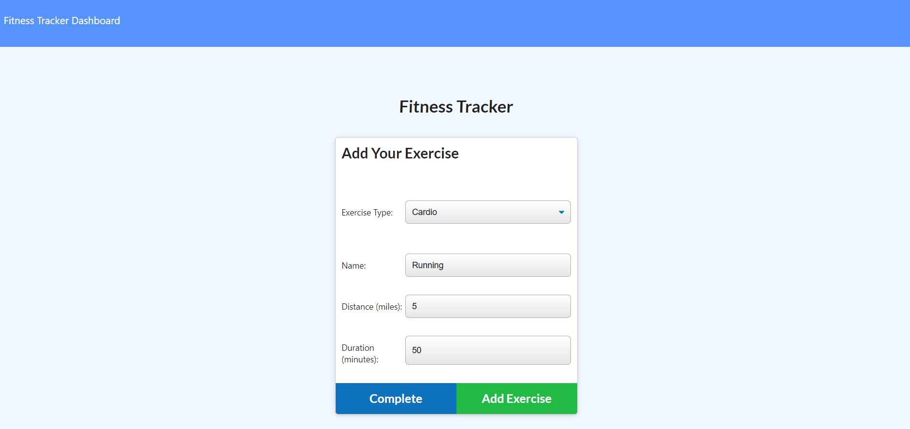
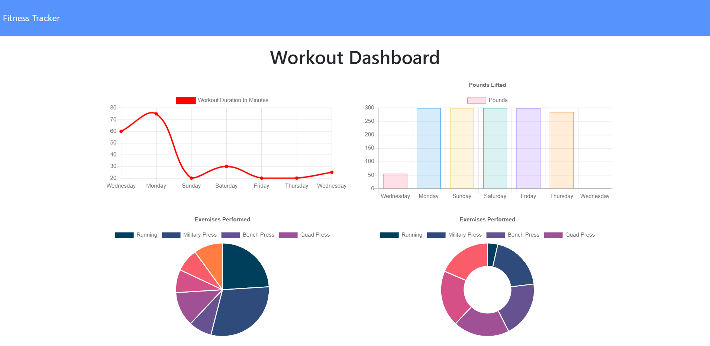

# Workout Tracker
## 
## Description 
Workout Tracker allows users to create workouts and add exercises to them. The Workout Tracker Dashboard 

displays the most recent seven workouts and graphs the total time per workout and total weight lifted. 

The specific type of exercise is also graphed by percent of total workouts.
## Table of Contents
- [Installation](#installation)
- [Usage](#usage)
- [Screenshot](#screenshot)
- [License_Details](#license_details)
- [Contributing](#contributing) 
- [Tests](#tests)
- [Questions](#questions)
## Installation
To install the necessary dependencies run:

npm i

To install to run locally, run "nmp i" to install the required dependencies. 

To run the deployed link, run: https://todayirun.herokuapp.com/.
## Usage
Link to deployed application: https://todayirun.herokuapp.com/. 

Follow the screens to update the most recent workout or to create a new workout. 

Add exercises to new workouts. Track workouts on the Dashboard.

## Screenshot

## License_Details

This project is licensed through: MIT

## Contributing

Coleen Stuhlfire

## Tests

Run the application and enter workouts. Review the stats displayed in the dashboard.

## Questions

If you have questions about the repo, open an issue or contact me at 
cstuhlfire@gmail.com. 

You can find this project along with my other work 
at https://github.com/cstuhlfire.

